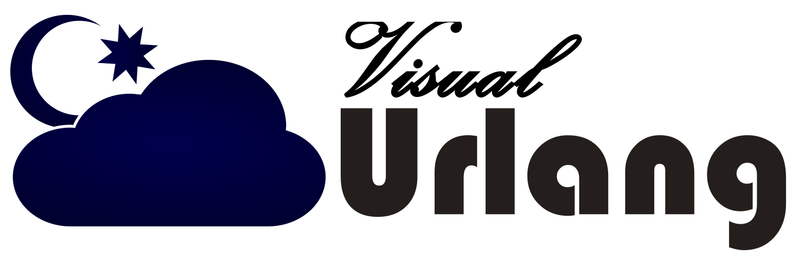

[![Build Status][1]][2]

[1]: https://img.shields.io/appveyor/ci/DangerRust/visual-urlang.svg
[2]: https://ci.appveyor.com/project/DangerRust/visual-urlang

Visual Urlang is a new programming language in the BASIC family.

## Outline.

Visual Urlang builds on the Web Scale Object Model (WSOM) and includes features
like Modules and Anonymous Functions from ML as well as introducing
Polymorphic Identifiers.

Consider this Class Module with a Functor for example:

```vb6
Functor (T As Type)

Public Function GetAT(ByVal a_t As T)
    Dim anonymous_function = Function (ByVal a_t As T)
                                 Return a_t
                             End Function
    GetAT = local://anonymous_function(a_t)
End Function
```

There is documentation be created in the Docs: Read it [here](Docs/README.md).

## Community
Contributors to Visual Urlang are welcomed. There is no formal code of conduct.
Anyone who wants to participate in the community should behave in a Christian
way. If you are respectful and do not act egotistically, you are welcome to be
part of the Visual Urlang community, regardless of your religion or other
characteristics.

## Copying
Visual Urlang is open source, the software is available under the Creative Commons
CC-NC-SA 4.0 license. Please find a copy of the license in the file [EULA.md](EULA.md).

The WSOM SDK is licensed under the Common Distribution and Development License
(CDDL) version 1.1. Details are found in the file [WSOM_SDK/COPYING.md](WSOM_SDK/COPYING.md).

Code under the folder *External* is imported from other projects and each package
has its own subdirectory there with a license.